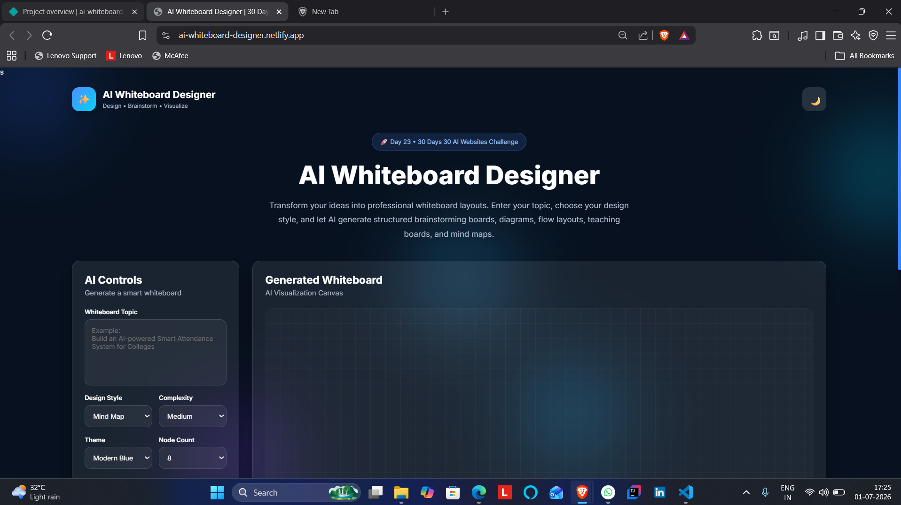
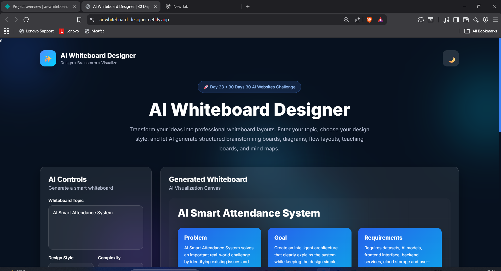
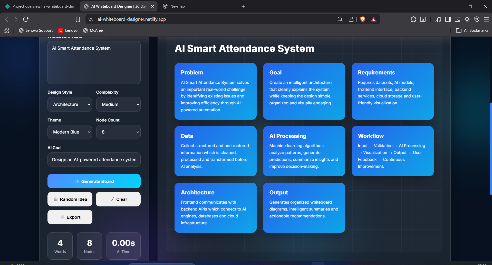

# AI Whiteboard Designer

## 🚀 Day 23 of my 30 Days 30 AI Websites Challenge

AI Whiteboard Designer is an AI-inspired web application that helps users transform ideas into structured and visually organized whiteboards.

Instead of manually arranging thoughts on a blank canvas, users simply enter a topic, select a whiteboard style, choose the desired complexity and theme, and instantly generate an organized whiteboard layout containing key sections such as the problem, goals, workflow, architecture, AI processing, benefits, challenges, and future scope.

The application demonstrates how AI-powered brainstorming and visual thinking tools can simplify planning, teaching, presentations, software design, project discussions, and idea organization.

Although built using HTML, CSS, and JavaScript, the project simulates the workflow of modern AI whiteboard assistants by automatically organizing concepts into professional visual boards.

---

## 🌐 Live Demo

https://ai-whiteboard-designer.netlify.app/

---

## 📸 Screenshots

---

## ✨ Features

* AI Whiteboard Generation
* Multiple Whiteboard Styles
* Mind Map Layout
* Flowchart Layout
* Architecture Board
* Teaching Board
* Roadmap View
* Brainstorm Layout
* Multiple Board Themes
* AI Statistics
* Word Counter
* Node Counter
* Generation Time Indicator
* Random Project Generator
* Dark / Light Mode
* Export Whiteboard
* Fully Responsive Design

---

## 📋 How It Works

1. Enter your project or idea.
2. Select the preferred whiteboard style.
3. Choose the complexity level.
4. Select a board theme.
5. Click **Generate Board**.
6. Explore the AI-generated whiteboard.
7. Export the generated whiteboard if needed.

---

## 🛠 Technologies Used

* HTML
* CSS
* JavaScript
* Built with the help of AI-assisted development tools

---

## 🎯 Challenge Progress

✅ Day 23 Completed — AI Whiteboard Designer

Part of my **30 Days 30 AI Websites Challenge**, where I build and publish one AI-inspired web application every day to improve my frontend development, product-building, UI/UX design, and problem-solving skills.

---

## 👨‍💻 Author

**Bettam Anand**

B.Tech CSE (Data Science)

JNTUH University College of Engineering Palair
